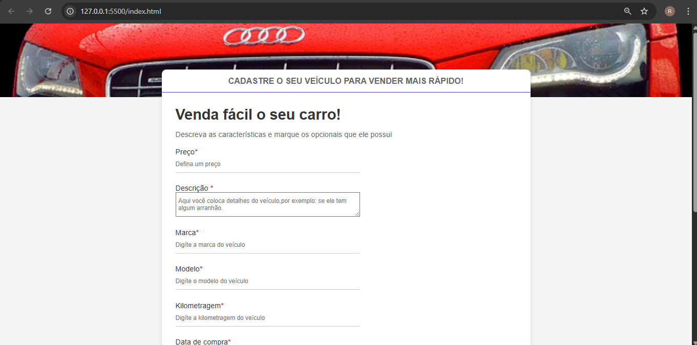

# 🚗 Formulário de Venda de Veículos

Projeto de formulário para cadastro de veículos feito com **HTML5 e CSS3**,
com foco em boas práticas, design responsivo e validação visual de campos.

---

## ✅ Funcionalidades

- Campos de texto para preço, marca, modelo, quilometragem e descrição
- Upload de imagens do veículo
- Seleção de opcionais com checkboxes
- Escolha de tipo de câmbio (manual ou automático)
- Validação visual: bordas verdes/vermelhas nos campos obrigatórios
- Estilo moderno com CSS puro

---

## 🧪 Tecnologias utilizadas

- HTML5
- CSS3 (puro, com responsividade)
- Validação de formulário nativa com HTML
- Feedback visual com seletores CSS `:valid` / `:invalid`

---

## 💻 Como usar localmente

1. Clone o repositório:
   ```bash
   git clone https://github.com/seu-usuario/formulario-veiculos.git
   ## 🖼️ Exemplo da interface




 
